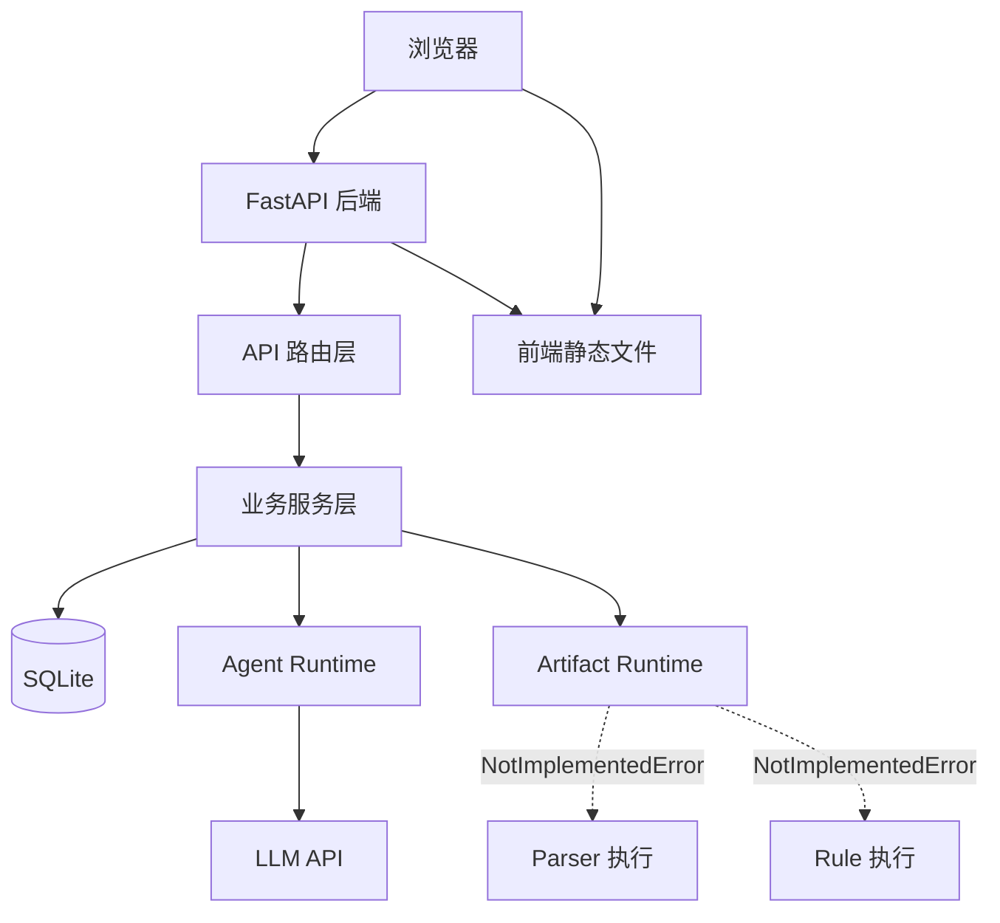

# 系统架构

## 整体架构



## 请求流

```
浏览器请求 → FastAPI → 认证中间件 → API 路由 → Service 层 → DB/Agent/Artifact
```

- **路由层**（`backend/api/`）：接收请求、参数校验、调用 service、返回统一响应格式
- **服务层**（`backend/services/`）：业务逻辑、数据库操作、外部调用
- **数据层**（`backend/db/`）：ORM 表定义，通过 SQLAlchemy 操作 SQLite
- 路由层**不承载业务逻辑**

## 统一响应格式

```json
{ "code": 0, "message": "ok", "data": {} }
```

## SPA 路由

非 `/api` 且非静态资源的路径，一律返回 `index.html`，由前端 Vue Router 处理。

## 当前边界

| 系统 | 状态 |
|------|------|
| FastAPI 后端 | 已完成 |
| Vue 前端 | 已完成 |
| SQLite + Alembic 迁移 | 已完成 |
| Agent Runtime | 已完成（通用 Agent、工具、记忆、技能） |
| Artifact Runtime | **部分完成** — `run_parser` 已实现；`run_rule` 为 NotImplementedError (Phase H1) |
| Workflow Executor | 代码已存在，执行器和节点注册机制可用，但不等于 production-ready |

---
**校准来源：** `backend/main.py`、`backend/api/`、`backend/services/`、`backend/core/artifact_runtime.py`
**最后校准：** 2026-05-17
