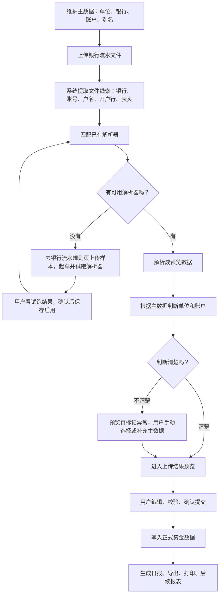

# Agent 定位与银行导入后续开发计划

> 本文给非开发者阅读。它说明：项目里的 Agent 到底做什么，解析器和规则到底怎么分工，后续开发按什么顺序推进，做到什么程度才算完成。

## 一句话结论

这个项目当前不要继续扩张“很多 Agent”。先把一条真实业务闭环做稳：上传银行流水，系统读出数据，识别属于哪个单位和账户，给用户预览和修改，用户确认后写入正式数据，再生成需要的报表。

Agent 在这里不是“自动替你做财务决定的人”。它更像一个会看样本、会起草方案的助手。它可以帮你写出“怎么读这个银行文件”的候选方案，也可以以后帮你写出“怎么把确认后的数据填进报表”的候选方案。但最终启用、修改、确认、入账、出报表，必须由系统流程和用户确认控制。

## 当前项目里 Agent 的大白话定位

Agent 的位置应该是“副驾驶”，不是“老板”。

它可以做：

1. 看一份银行流水样本，帮你起草一套读取文件的方案。
2. 看一份报表模板，帮你起草一套填写报表的方案。
3. 解释它为什么这样处理字段、日期、金额、摘要。
4. 把候选方案交给系统试跑，让你看结果。

它不能做：

1. 不能绕过你的确认，把数据直接写进正式账。
2. 不能猜某条流水属于哪个单位或账户。
3. 不能自己批准自己生成的方案。
4. 不能因为没有线索就默认选择第一个账户。
5. 不能变成很多个领域专用 Agent 来绕开现有架构。

对你来说，判断 Agent 是否“够用”的标准不是术语是否高级，而是这三句话是否成立：

1. 它能帮我减少重复规则编写。
2. 它给出的结果能被试跑、预览、退回、重新生成。
3. 它不能跳过我能看懂的确认环节。

## 解析器和规则的分工

解析器和规则不是一个东西。它们容易混，是因为它们都像“说明书”，但作用位置完全不同。

| 名称 | 大白话解释 | 发生在什么时候 | 保存在哪里 | 谁来生成 | 谁来确认 |
|---|---|---|---|---|---|
| 解析器 | 读懂上传文件的说明书。它负责把银行流水、手工 Excel 里的行列读成系统认识的数据 | 上传文件之后，进入预览之前 | 银行流水规则页对应的后端保存表 | 用户上传样本后，可由 Agent 起草，也可人工维护 | 用户看试跑结果后保存启用 |
| 规则 | 填报表的说明书。它负责把已经确认无误的数据填到某张报表模板的指定位置 | 数据已经确认之后，生成报表时 | 报表模板相关的后端保存表 | 以后由模板上传流程和 Agent 起草 | 用户看模板填写结果后保存启用 |

最重要的边界：

1. 解析器只负责“读文件”，不负责决定最终属于哪个账户。
2. 账户归属要靠文件线索加主数据匹配，例如账号、户名、银行名、开户行、单位名。
3. 规则只负责“填报表”，它不应该重新解析原始银行文件。
4. 解析器和规则都必须能试跑，用户看得到结果，才能启用。

## 银行流水闭环应该怎么走

这个闭环里，真正不可省略的是三件事：

1. 先有主数据，否则系统不知道“钱属于谁”。
2. 先预览再入账，否则错误会直接污染正式数据。
3. 没有线索必须让用户处理，不能假装自动识别。

## 后续开发顺序

### 第一阶段：治理污染和口径统一

目标：清掉会误导 AI Coding 工具的旧阶段说法，统一文档口径，让后续任务不再跑偏。

必须完成：

1. 本地 active docs、样本、测试、脚本中不再出现旧阶段编号表达。
2. GitHub 上仍开放且会误导后续工作的议题或 PR 必须关闭或改写。
3. 文档里明确：当前只追一条真实资金日报闭环，不扩张票据、费用、贷款等旁支。

验收标准：

1. 搜索 active docs、测试、样本、脚本、协作任务目录，不再出现旧阶段编号表达。
2. 剩余命中只允许是外部厂商真实接口地址、模型商品名、数据库历史迁移文件名或物理表名。
3. 任意 AI Coding 工具开工前，只读 `docs/README.md` 能知道当前该做什么、不该做什么。

### 第二阶段：上传结果预览表格可用化

目标：让预览表格像财务人熟悉的 Excel 一样能快速修正数据。

必须完成：

1. 单元格可编辑。
2. 支持复制、粘贴、键盘移动、批量填充。
3. 异常行能高亮，用户能只看异常。
4. 用户修改后重新校验。
5. 未解决异常时不能提交正式数据。

验收标准：

1. 上传一份含异常的银行流水，用户能在预览页直接修正。
2. 粘贴多行数据不会错位。
3. 修改单位、账户、金额、日期后，校验结果即时更新或可手动重新校验。
4. 异常未处理时提交按钮不可用，并显示人能看懂的原因。

### 第三阶段：银行流水识别证据可视化

目标：让用户知道系统为什么判断这条流水属于某个单位和账户。

必须完成：

1. 展示文件里提取到的线索，例如账号、户名、银行名、开户行、文件名。
2. 展示匹配到了哪些主数据。
3. 展示判断结果：已匹配、有歧义、未匹配。
4. 用户能在预览页修正归属，并把修正结果沉淀为以后可复用的线索。

验收标准：

1. 一条流水为什么匹配到某个账户，用户能在界面上看懂。
2. 多个候选账户时，系统不自动选，必须让用户选。
3. 用户修正后，再次上传同类文件时系统能优先复用已确认线索。

### 第四阶段：解析器生成流程稳定

目标：让“银行流水规则页”真正成为生成和维护解析器的地方。

必须完成：

1. 上传样本后，系统能提取表头和代表性数据。
2. Agent 只负责起草读取方案。
3. 候选方案必须试跑成功，才能保存。
4. 保存时记录适用银行和文件格式。
5. 禁止把具体单位、具体账户写死在解析器里。

验收标准：

1. 中国银行、工商银行等不同样式的样本可以分别保存读取方案。
2. 同一银行同一格式的不同账户，不需要重复写多套读取方案。
3. 样本试跑结果为空、字段错位、金额方向错误时不能保存。
4. 解析器保存后，银行流水上传页能自动匹配并进入预览。

### 第五阶段：报表填写规则执行

目标：让“已确认资金数据 → 报表模板”的链路跑通。

必须完成：

1. 报表模板上传后，系统能识别需要填写的位置。
2. 用户能建立字段和报表位置的对应关系。
3. 候选填写方案必须试跑，用户能下载或预览填好的报表。
4. 只有确认后的资金数据可以进入报表。

验收标准：

1. 上传一张真实日报模板，系统能填出余额、收入、支出等关键数字。
2. 报表数字能追溯到正式资金数据。
3. 模板字段缺失时给出明确错误，而不是生成空报表。
4. 报表生成失败不会污染正式数据。

### 第六阶段：整体闭环验收

目标：用真实样本证明系统不是演示，而是能承接财务人的日常工作。

必须完成：

1. 准备多银行、多账户、多单位样本。
2. 覆盖账号明确、只有后四位、只有户名、完全无身份线索四类情况。
3. 覆盖用户手动修正、重新校验、提交、报表生成。
4. 补齐后端测试、前端关键路径测试和浏览器验收记录。

验收标准：

1. 从上传银行流水到生成报表，全程不需要改代码。
2. 错误数据不会绕过预览进入正式资金数据。
3. 同类文件第二次上传时，比第一次更省人工。
4. 文档、页面、接口、测试口径一致。

## 给 AI Coding 工具的任务包模板

### 目标

围绕“上传银行流水 → 预览校验 → 用户确认 → 正式资金数据 → 报表”的闭环开发，不新增平行实现，不扩张旁支模块。

### 背景

用户不是开发者，需求会随着理解变化而调整。任何开发任务都必须先确认真实代码和文档现状，再拆成用户能验收的结果。

### 必须读取的文件

1. `docs/README.md`
2. `docs/00_PROJECT_STATE.md`
3. `docs/01_PRODUCT_SCOPE.md`
4. `docs/04_DATA_LIFECYCLE.md`
5. `docs/05_FRONTEND_MAP.md`
6. `docs/06_BACKEND_MAP.md`
7. `docs/14_BANK_IMPORT_GENERALIZATION.md`
8. 本文档
9. 本次任务涉及的前端页面、后端 API、service、测试文件

### 需要先确认的项目事实

1. 当前路由和页面是否真实存在。
2. 当前 API 是否已被前端调用。
3. 数据库表和字段是否真实存在。
4. 现有测试是否覆盖这条链路。
5. 文档描述是否与代码冲突。

### 允许修改范围

1. 当前任务直接相关的页面、API、service、测试和文档。
2. 必要的样本文件和验收说明。

### 禁止修改范围

1. 不新增领域专用 Agent。
2. 不新增平行上传、平行解析、平行报表链路。
3. 不跳过上传结果预览。
4. 不写死单位、账户、银行格式、金额方向。
5. 不为了演示把异常吞掉。

### 实施步骤

1. 先读真实代码和文档。
2. 画出本次功能的输入、处理、输出、失败状态。
3. 写或更新最小测试。
4. 实现后端服务逻辑。
5. 接入前端页面。
6. 用浏览器走一遍用户操作。
7. 更新文档和验收记录。

### 风险点

1. 文件读出来了，但单位账户归属错了。
2. 页面能展示，但不能编辑或不能重新校验。
3. Agent 生成了候选方案，但用户看不懂结果。
4. 报表生成成功，但数字无法追溯。
5. 文档说已完成，代码实际只是占位。

### 测试方式

1. 后端单元测试：匹配、解析、预览、提交、报表生成。
2. 前端浏览器测试：上传、编辑、异常处理、确认提交。
3. 样本测试：至少覆盖多银行、多账户、多单位和异常样本。
4. 搜索测试：防止旧口径、写死数据、平行实现再次出现。

### 验收标准

1. 用户按页面操作能完成闭环。
2. 每一步失败都有明确提示和恢复路径。
3. 正式数据只来自用户确认后的预览结果。
4. 文档、测试、代码说的是同一件事。

### 完成后的复查方式

1. 搜索新增文件是否出现禁止口径。
2. 检查是否新增平行实现。
3. 跑相关测试和构建。
4. 浏览器录入一条真实路径。
5. 更新 `docs/00_PROJECT_STATE.md` 和相关任务记录。

### 回滚方案

1. 后端改动按文件回退。
2. 前端改动按页面回退。
3. 数据库改动必须有迁移回滚或明确的只读兼容策略。
4. 若已写入测试数据，必须说明清理 SQL 或清理入口。

## 当前推荐决策

继续推动 Agent，但只把它放在“起草方案”的位置。当前不要追求“自建 Agent 平台”，也不要让 Agent 直接进入日常入账链路。先把银行导入和报表生成的真实闭环做成，再考虑更多自动化。

你作为非开发者，后续只需要抓住四个验收问题：

1. 我上传真实文件了吗？
2. 我看见系统识别和匹配的理由了吗？
3. 我能改、能确认、能阻止错误提交吗？
4. 我最终拿到的报表能追溯到确认过的数据吗？

这四个问题都能回答“是”，项目才算真的往前走。
